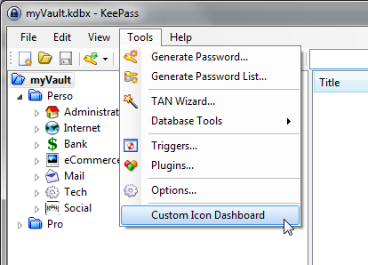
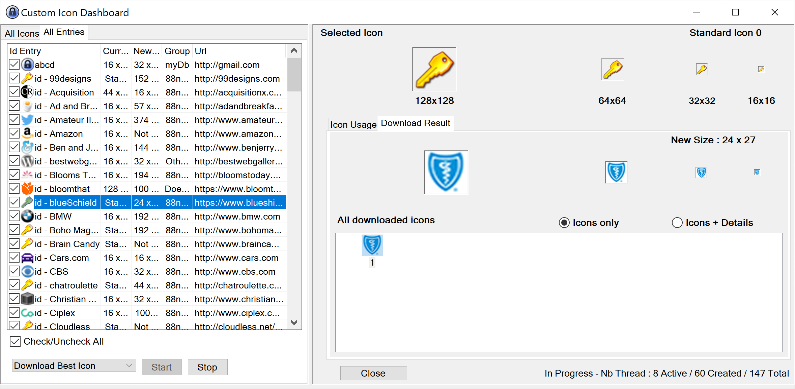

# KeePass Custom Icon Dashboarder

This plugin provides some management features and statistics for custom icons in KeePass.

High definition of custom icon can be uploaded. URLs of associated entries are used to 
retrieve the highest definition of icons.

For each custom icon, the following information is available:
- Number and list of entries that use it
- Number and list of groups that use it

Features are:
- Download highest definition of custom icons from favicon URL
- Remove custom icons
- Modify custom icons of groups and entries
- Get list of custom icons in KeePass
- Get number and list of entries used by each custom icon
- Get number and list of groups used by each custom icon

## Installation

### Pre-requisites

- KeePass Password Safe 2.00+
- Framework .NET 4.5+

### Installation steps
1. Download [latest](https://github.com/incognito1234/Keepass-Custom-Icon-Dashboarder/releases/latest) plgx release
2. Put the _.plgx_ file into a folder called **plugins** inside your KeePass Password Safe installation folder

## Screenshots
A menu item is added to **Tool** menu

Custom icon Dashboard (downloading in progress)

## Changelog

### Version 1.2.0
- Simultaneous icon downloads by introducing multithreading
- Remember size and position of dashboard when closing windows
- Plugin is now hosted by github
- Improvements:
   - Update HtmlAgilityPack with version v1.11.12

### Version 1.1.0
- All icons from URL are downloaded. The best-sized icon is choosen by default.
  Then it is possible to change manually the choosen icon.
- Add support of downloading icons of entries with standard icons.
- Display index of selected icon in the upper right corner of dashboard.

### Version 1.0.0
- Add support for downloading icons from url of entries

### Version 0.3.0
- Display size of icons in the list icon view
- Display selected icon with different sizes 

### Version 0.2.1
- Ensure that icon list is correctly rebuilt after a removal (Ticket #2)

### Version 0.2
- Add support for modifying custom icons
- Add support for removing custom icons

### Version 0.1
- Enhance Dashboard Form: resizable and sortable lists
- Add the column "total" in the list icon view
- Disable menu item if no database is open
- Change version numbering: x.y.z -> x.y

### Version 0.0.1
- Initial version
